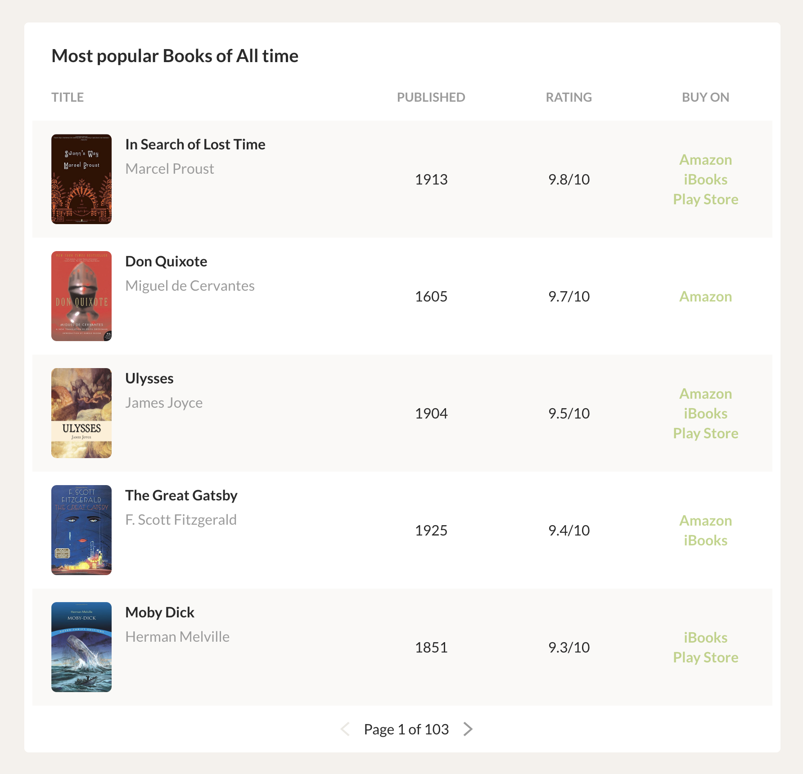

# Node.js Fullstack Engineer Challenge

You can submit all the answers to this assignment in a **private**, single repository or as a 
zipped folder, containing markdown and code. If you use GitHub, please share your answers with 
[**reedsyapplications**](https://github.com/reedsyapplications).

Answering all the questions to a Production-level standard should take approximately 1 work 
day.

**For coding questions use the latest Node LTS**.

## 1. About you

Tell us about one of your commercial projects with Node.js and/or Vue.js.


## 2. Document versioning

Detail how you would store several versioned novels.

Your approach should:

- [ ] show the novel in its current state
- [ ] show the novel at any point in its history
- [ ] show the changes made between two versions
- [ ] prioritize disk space efficiency
- [ ] discuss any trade-offs made, as well as potential mitigations
- [ ] consider any potential domain-specific issues

## 3. Node.js REST API

Implement a REST API using Express.js that handles Export and Import requests.

The API should expose endpoints to:
- `POST` a request for a **new Export job**. Valid requests should be saved in memory. Invalid 
requests should return an error. The request must have the following schema:

  ```javascript
  {
    bookId: string,
    type: "epub" | "pdf"
  }
  ```

- `GET` a list of **Export requests**, grouped by their current `state` (see below).
- `POST` a request for a new **Import job**. Valid requests should be saved in memory. Invalid 
requests should return an error. The request must have the following schema:

  ```javascript
  {
    bookId: string,
    type: "word" | "pdf" | "wattpad" | "evernote",
    url: string
  }
  ```

- `GET` a list of **Import requests**, grouped by their current `state` (see below).

Both export and import requests should be created with a `pending` state, and with a 
`created_at` timestamp. An import or export should take the amount of time outlined below. 
After the specified time, the state should be updated from `pending` to `finished` and update 
an `updated_at` timestamp.

| Job type     | Processing time (s) |
| ------------ | ------------------- |
| ePub export  | 10                  |
| PDF export   | 25                  |
| import (any) | 60                  |

Your solution should:

- [ ] use TypeScript or modern ES features
- [ ] have reasonable test coverage
- [ ] be scalable — this is a small app, but write it as if it will grow into a full, 
Production-grade server
- [ ] be data store agnostic

## 4. SPA

Using **Vue.js**, create a basic SPA that implements the following UI:




Your solution should:

- [ ] use Vue.js
- [ ] display 5 books per page
- [ ] have multiple pages to have pagination
- [ ] expand/collapse details when clicking the book
- [ ] improve the UI as you see fit
- [ ] have reasonable test coverage
- [ ] be scalable — this is a small app, but write it as if it will grow into a full, 
Production-grade SPA
- [ ] assume books will be fetched over HTTP
